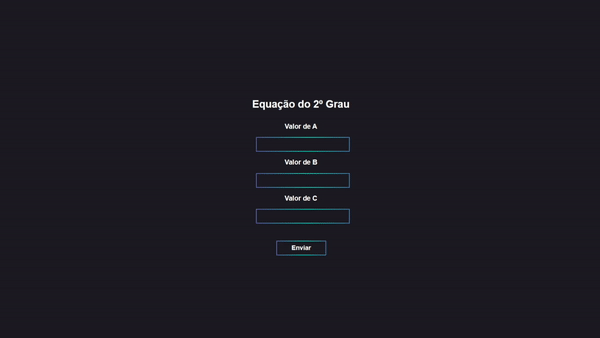

# Form_PHP
Meu primeiro bimestre trabalhando com PHP, esse arquivo é a minha avaliação bimestral sobre o assunto (1ºBimestre/2021) 

  
## Exercício 1
No HTML: Recebe o nome e data de nascimento do usuário 
 
No PHP: Imprime o nome digitado, faz o cálculo com base na data de nascimento e na data atual e imprime a idade do usuário

## Exercício 2
No HTML: Recebe o valor das variáveis a, b, c 
 
No PHP: A partir das variáveis recebidas, efetua uma equação do 2º grau e imprime o valor de x1 e x2

## Exercício 3
No HTML: Recebe o valor das variáveis tria, trib, tric que são lados de um triângulo 
 
No PHP: A partir das variáveis recebidas, passa por um sistema de condição e imprime se o triângulo é isósceles, escaleno ou equiátero

  
## Exercício 4
No HTML: Recebe o valor das variáveis nome, peso, altura
 
No PHP: A partir das variáveis recebidas, efetua o cálculo do IMC e imprime o nome e o valor de IMC

## Exercício 5
No HTML: Recebe o valor da variável color 
 
No PHP: Surge um sistema de condição para ver se a cor digitada é uma das permitidas (red, blue, green ou lightblue), se for uma das permitidas, o background se altera para a cor digitada. Se não, imprime o background do css.

  
## Exercício 6
No HTML: Recebe o valor das variáveis tria, trib, tric que são lados de um triângulo 
 
No PHP: A partir das variáveis recebidas, passa por um sistema de condição, e imprime se o triângulo pode ser formado, se sim ele classifica o triângulo em retângulo, obtusângulo ou acutângulo 

  
